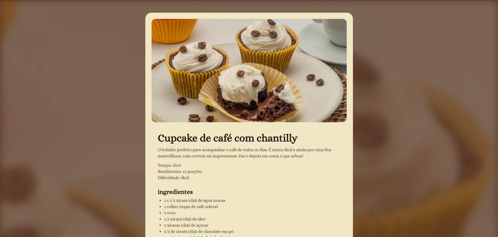

# 🧁 Receita de Cupcake de Café com Chantilly

Página web dedicada a apresentar uma **receita de cupcake de café com chantilly** de forma elegante e visualmente agradável. Projeto desenvolvido como um dos meus primeiros exercícios práticos de HTML e CSS, focando em estrutura semântica e estilização básica.

## 📸 Preview

  

## 🚀 Demonstração

🔗 [Acesse o site](https://rochacode08.github.io/Cupcake-de-cafe-com-chantilly/)

## 🛠️ Tecnologias utilizadas

- **HTML5** — estruturação semântica da página
- **CSS3** — estilização e layout
- **Google Fonts** — tipografia com a fonte *Alice*

## ✨ O que a página apresenta

- 🧁 Imagem de destaque do cupcake
- 📝 Informações sobre a receita (tempo, rendimento e dificuldade)
- 🥄 Lista completa de ingredientes
- 👩‍🍳 Modo de preparo detalhado, passo a passo
- 🔗 Rodapé com links para redes sociais e contato

## 🎨 Paleta de cores

Paleta em tons amadeirados e quentinhos, inspirada no tema café:

| Cor            | Hex       |
| -------------- | --------- |
| 🟤 Marrom café | `#573A37` |
| ⚫ Marrom escuro| `#291B1A` |
| 🟡 Creme       | `#F0E8C2` |

## 📂 Estrutura do projeto

```
📦 receita-cupcake
 ┣ 📂 assets
 ┃ ┣ 🖼️ main-image.jpg              → Imagem principal do cupcake
 ┃ ┣ 🖼️ bg.png                      → Imagem de fundo da página
 ┃ ┣ 🖼️ instagram-1-svgrepo-com.svg → Ícone do Instagram
 ┃ ┗ 🖼️ linkedin-1-svgrepo-com.svg  → Ícone do LinkedIn
 ┣ 📜 index.html                     → Página principal
 ┗ 📜 style.css                      → Estilos da página
```

## 💻 Como rodar o projeto

Clone o repositório:

```bash
git clone https://github.com/rochacode08/Cupcake-de-cafe-com-chantilly.git
```

Acesse a pasta do projeto:

```bash
cd Cupcake-de-cafe-com-chantilly
```

Abra o arquivo `index.html` no navegador — ou utilize a extensão **Live Server** do VS Code para recarregamento automático.

## 📚 O que eu aprendi

Este foi um dos meus primeiros projetos práticos de desenvolvimento web. Com ele, pratiquei:

- Estruturação semântica com HTML5 (`<main>`, `<section>`, `<footer>`)
- Uso de `id` e `class` para seleção de elementos
- Organização de conteúdo em seções (sobre, ingredientes, modo de preparo)
- Importação e uso de fontes do **Google Fonts**
- Uso de `background-image` no `body`
- Estilização com **Flexbox** e box model (padding, margin, border-radius)
- Uso do seletor `+` para aplicar margem entre elementos irmãos (`section + section`)
- Integração de ícones SVG para redes sociais
- Criação de links de contato com `mailto:`

## 🔮 Melhorias futuras

Como este foi um projeto inicial **sem responsividade**, pretendo evoluí-lo adicionando:

- [ ] Layout responsivo com **Media Queries** para tablets e celulares
- [ ] Interatividade com JavaScript (ex: botão para marcar ingredientes usados)
- [ ] Sistema de avaliação da receita (estrelas)
- [ ] Lista de outras receitas relacionadas
- [ ] Modo escuro (dark mode)
- [ ] Melhorias de acessibilidade (atributos `alt`, contraste, foco visível)

## 📝 Licença

Este projeto foi desenvolvido apenas para fins **educacionais e de estudo**.

---

## 👨‍💻 Autor
Desenvolvido com 💙 por **[Gabriel Rocha Lopes](https://github.com/rochacode08)**

<a href="mailto:gabrielrocha.devstack@gmail.com">
    
</a>
<a href="https://www.linkedin.com/in/gabriel-rocha-devstack">
    
</a>
<a href="https://www.instagram.com/gabriel_lopess15/">
    
</a>

---